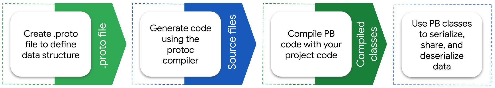

+++
title = "概述"
date = 2024-11-17T09:35:36+08:00
weight = 1
type = "docs"
description = ""
isCJKLanguage = true
draft = false

+++

> 原文：[https://protobuf.dev/overview/](https://protobuf.dev/overview/)
>
> 收录该文档的时间：`2024-11-17T09:35:36+08:00`

# Overview - 概述

Protocol Buffers are a language-neutral, platform-neutral extensible mechanism for serializing structured data.

​	Protocol Buffers（协议缓冲区）是一种与语言无关、平台无关且可扩展的机制，用于序列化结构化数据。

It’s like JSON, except it’s smaller and faster, and it generates native language bindings. You define how you want your data to be structured once, then you can use special generated source code to easily write and read your structured data to and from a variety of data streams and using a variety of languages.

​	它类似于 JSON，但体积更小、速度更快，并能生成原生语言绑定。您只需定义一次数据结构，然后可以使用生成的特定源代码，在各种数据流中以多种语言轻松地读写结构化数据。

Protocol buffers are a combination of the definition language (created in `.proto` files), the code that the proto compiler generates to interface with data, language-specific runtime libraries, the serialization format for data that is written to a file (or sent across a network connection), and the serialized data.

​	Protocol Buffers 包括以下部分：

- 定义语言（通过 `.proto` 文件创建）
- `proto` 编译器生成的与数据交互的代码
- 针对特定语言的运行时库
- 写入文件或通过网络传输的数据序列化格式
- 序列化后的数据

## Protocol Buffers 解决了哪些问题？What Problems do Protocol Buffers Solve?

Protocol buffers provide a serialization format for packets of typed, structured data that are up to a few megabytes in size. The format is suitable for both ephemeral network traffic and long-term data storage. Protocol buffers can be extended with new information without invalidating existing data or requiring code to be updated.

​	Protocol Buffers 提供了一种序列化格式，用于处理几兆字节以内的类型化、结构化数据包。这种格式既适合短暂的网络流量，也适合长期的数据存储。Protocol Buffers 支持扩展新信息，而不会破坏现有数据或要求更新代码。

Protocol buffers are the most commonly-used data format at Google. They are used extensively in inter-server communications as well as for archival storage of data on disk. Protocol buffer *messages* and *services* are described by engineer-authored `.proto` files. The following shows an example `message`:

​	Protocol Buffers 是 Google 内部最常用的数据格式，广泛用于服务器间通信以及磁盘上的数据归档存储。协议缓冲区的*消息（messages）*和*服务（services）*通过 `.proto` 文件定义。例如：

```proto
message Person {
  optional string name = 1;
  optional int32 id = 2;
  optional string email = 3;
}
```

The proto compiler is invoked at build time on `.proto` files to generate code in various programming languages (covered in [Cross-language Compatibility](https://protobuf.dev/overview/#cross-lang) later in this topic) to manipulate the corresponding protocol buffer. Each generated class contains simple accessors for each field and methods to serialize and parse the whole structure to and from raw bytes. The following shows you an example that uses those generated methods:

​	在构建时，`proto` 编译器会对 `.proto` 文件进行编译，生成可以用多种编程语言操作的代码（详见[跨语言兼容性](https://protobuf.dev/overview/#cross-lang)）。每个生成的类都包含访问每个字段的简单方法，以及将整个结构与原始字节之间进行序列化和解析的方法。例如：

```java
Person john = Person.newBuilder()
    .setId(1234)
    .setName("John Doe")
    .setEmail("jdoe@example.com")
    .build();
output = new FileOutputStream(args[0]);
john.writeTo(output);
```

Because protocol buffers are used extensively across all manner of services at Google and data within them may persist for some time, maintaining backwards compatibility is crucial. Protocol buffers allow for the seamless support of changes, including the addition of new fields and the deletion of existing fields, to any protocol buffer without breaking existing services. For more on this topic, see [Updating Proto Definitions Without Updating Code](https://protobuf.dev/overview/#updating-defs), later in this topic.

​	由于 Protocol Buffers 被广泛用于 Google 的各种服务，并且数据可能长期存在，因此保持向后兼容性非常重要。Protocol Buffers 支持无缝的变更，例如添加新字段和删除现有字段，而不会破坏现有服务。更多信息请参阅 [更新 Proto 定义而无需更新代码](https://protobuf.dev/overview/#updating-defs)。

## 使用 Protocol Buffers 的优势 What are the Benefits of Using Protocol Buffers?

Protocol buffers are ideal for any situation in which you need to serialize structured, record-like, typed data in a language-neutral, platform-neutral, extensible manner. They are most often used for defining communications protocols (together with gRPC) and for data storage.

​	Protocol Buffers 非常适合需要以与语言无关、平台无关且可扩展的方式序列化结构化、记录类型化数据的场景。它们最常用于定义通信协议（通常与 gRPC 结合使用）和数据存储。

Some of the advantages of using protocol buffers include:

​	使用 Protocol Buffers 的一些优势包括：

- Compact data storage
  - 紧凑的数据存储

- Fast parsing
  - 快速的解析

- Availability in many programming languages
  - 支持多种编程语言

- Optimized functionality through automatically-generated classes
  - 自动生成的类优化了功能

### 跨语言兼容性 Cross-language Compatibility

The same messages can be read by code written in any supported programming language. You can have a Java program on one platform capture data from one software system, serialize it based on a `.proto` definition, and then extract specific values from that serialized data in a separate Python application running on another platform.

​	相同的消息可以由任何支持的编程语言代码读取。例如，一个平台上的 Java 程序可以捕获数据，根据 `.proto` 定义序列化数据，然后另一个平台上的 Python 应用可以从序列化数据中提取值。

The following languages are supported directly in the protocol buffers compiler, protoc:

​	以下语言直接受 `proto` 编译器支持：

- [C++]()

- [C#]()
- [Java]()
- [Kotlin]()
- [Objective-C]()
- [PHP]()
- [Python]()
- [Ruby]()

The following languages are supported by Google, but the projects’ source code resides in GitHub repositories. The protoc compiler uses plugins for these languages:

​	Google 还支持以下语言，但项目源码托管在 GitHub 上，并通过 `proto` 编译器插件生成代码：

- [Dart](https://github.com/google/protobuf.dart)

- [Go](https://github.com/protocolbuffers/protobuf-go)

Additional languages are not directly supported by Google, but rather by other GitHub projects. These languages are covered in [Third-Party Add-ons for Protocol Buffers](https://github.com/protocolbuffers/protobuf/blob/master/docs/third_party.md).

​	一些语言并未由 Google 直接支持，而是由其他 GitHub 项目提供支持。这些语言的详细信息可以参考 [Protocol Buffers 的第三方插件](https://github.com/protocolbuffers/protobuf/blob/master/docs/third_party.md)。

### 跨项目支持 Cross-project Support

You can use protocol buffers across projects by defining `message` types in `.proto` files that reside outside of a specific project’s code base. If you’re defining `message` types or enums that you anticipate will be widely used outside of your immediate team, you can put them in their own file with no dependencies.

​	通过在特定项目代码库之外的 `.proto` 文件中定义 `message` 类型，您可以在多个项目中使用 Protocol Buffers。如果您定义的 `message` 类型或枚举预计会被团队以外的人员广泛使用，建议将它们放在一个没有依赖关系的独立文件中。

A couple of examples of proto definitions widely-used within Google are [`timestamp.proto`](https://github.com/protocolbuffers/protobuf/blob/master/src/google/protobuf/timestamp.proto) and [`status.proto`](https://github.com/googleapis/googleapis/blob/master/google/rpc/status.proto).

​	Google 内部广泛使用的 proto 定义示例如下：

​	[`timestamp.proto`](https://github.com/protocolbuffers/protobuf/blob/master/src/google/protobuf/timestamp.proto)

​	[`status.proto`](https://github.com/googleapis/googleapis/blob/master/google/rpc/status.proto)

### 无需更新代码即可更新 Proto 定义 Updating Proto Definitions Without Updating Code

It’s standard for software products to be backward compatible, but it is less common for them to be forward compatible. As long as you follow some [simple practices](https://protobuf.dev/programming-guides/proto3/#updating) when updating `.proto` definitions, old code will read new messages without issues, ignoring any newly added fields. To the old code, fields that were deleted will have their default value, and deleted repeated fields will be empty. For information on what “repeated” fields are, see [Protocol Buffers Definition Syntax](https://protobuf.dev/overview/#syntax) later in this topic.

​	软件产品通常要求向后兼容，但向前兼容并不常见。只要在更新 `.proto` 定义时遵循一些[简单实践](https://protobuf.dev/programming-guides/proto3/#updating)，旧代码可以读取新消息，而不会因为新增字段出错。对于旧代码，被删除的字段会返回默认值，而删除的重复字段将为空值。有关 “repeated” 字段的更多信息，请参阅 [Protocol Buffers 定义语法](https://protobuf.dev/overview/#syntax)。

New code will also transparently read old messages. New fields will not be present in old messages; in these cases protocol buffers provide a reasonable default value.

​	同时，新代码也可以透明地读取旧消息。在旧消息中不存在的新字段会被 Protocol Buffers 赋予合理的默认值。

### Protocol Buffers 不适用的场景 When are Protocol Buffers not a Good Fit?

Protocol buffers do not fit all data. In particular:

​	Protocol Buffers 并不适合所有数据，具体而言：

- Protocol buffers tend to assume that entire messages can be loaded into memory at once and are not larger than an object graph. For data that exceeds a few megabytes, consider a different solution; when working with larger data, you may effectively end up with several copies of the data due to serialized copies, which can cause surprising spikes in memory usage.
  - Protocol Buffers 假设整个消息可以一次性加载到内存中，并且大小不超过对象图。如果数据超过几兆字节，建议考虑其他解决方案；在处理较大数据时，由于序列化副本，可能会导致数据的多份拷贝，从而引发内存使用的意外激增。

- When protocol buffers are serialized, the same data can have many different binary serializations. You cannot compare two messages for equality without fully parsing them.
  - 当 Protocol Buffers 被序列化时，相同的数据可能会有多种二进制序列化形式。在未完全解析的情况下，无法比较两个消息是否相等。

- Messages are not compressed. While messages can be zipped or gzipped like any other file, special-purpose compression algorithms like the ones used by JPEG and PNG will produce much smaller files for data of the appropriate type.
  - 消息未被压缩。虽然消息可以像普通文件一样被 zip 或 gzip 压缩，但对于特定类型的数据（如图像），JPEG 和 PNG 等专用压缩算法能够生成更小的文件。

- Protocol buffer messages are less than maximally efficient in both size and speed for many scientific and engineering uses that involve large, multi-dimensional arrays of floating point numbers. For these applications, [FITS](https://en.wikipedia.org/wiki/FITS) and similar formats have less overhead.
  - 在涉及大型多维浮点数组的科学和工程应用中，Protocol Buffers 在大小和速度上效率较低。对于这些应用，[FITS](https://en.wikipedia.org/wiki/FITS) 或类似格式的开销更小。

- Protocol buffers are not well supported in non-object-oriented languages popular in scientific computing, such as Fortran and IDL.
  - Protocol Buffers 在 Fortran 和 IDL 等科学计算中流行的非面向对象语言中的支持较差。

- Protocol buffer messages don’t inherently self-describe their data, but they have a fully reflective schema that you can use to implement self-description. That is, you cannot fully interpret one without access to its corresponding `.proto` file.
  - Protocol Buffers 消息并不能自描述其数据，但它有一个完全反射的模式，您可以使用该模式来实现自描述功能。也就是说，如果没有对应的 `.proto` 文件，无法完全解释消息。

- Protocol buffers are not a formal standard of any organization. This makes them unsuitable for use in environments with legal or other requirements to build on top of standards.
  - Protocol Buffers 不是任何组织的正式标准，因此不适合需要建立在正式标准基础上的环境，例如存在法律或其他规范要求的情况。


## 谁在使用 Protocol Buffers？ Who Uses Protocol Buffers?

Many projects use protocol buffers, including the following:

​	许多项目使用 Protocol Buffers，包括以下内容：

- [gRPC](https://grpc.io/)
- [Google Cloud](https://cloud.google.com/)
- [Envoy Proxy](https://www.envoyproxy.io/)

## Protocol Buffers 如何工作？How do Protocol Buffers Work?

The following diagram shows how you use protocol buffers to work with your data.

​	以下图示展示了使用 Protocol Buffers 处理数据的工作流程：


**Figure 1. Protocol buffers workflow**

​	图 1. Protocol Buffers 工作流程

The code generated by protocol buffers provides utility methods to retrieve data from files and streams, extract individual values from the data, check if data exists, serialize data back to a file or stream, and other useful functions.

​	Protocol Buffers 生成的代码提供以下实用方法：

- 从文件和流中检索数据
- 提取单个值
- 检查数据是否存在
- 将数据序列化回文件或流
- 其他有用功能

The following code samples show you an example of this flow in Java. As shown earlier, this is a `.proto` definition:

​	以下代码示例展示了 Protocol Buffers 在 Java 中的工作流程。首先，这是一个 `.proto` 定义：

```proto
message Person {
  optional string name = 1;
  optional int32 id = 2;
  optional string email = 3;
}
```

Compiling this `.proto` file creates a `Builder` class that you can use to create new instances, as in the following Java code:

​	编译该 `.proto` 文件会创建一个 `Builder` 类，用于生成新实例，例如：

```java
Person john = Person.newBuilder()
    .setId(1234)
    .setName("John Doe")
    .setEmail("jdoe@example.com")
    .build();
output = new FileOutputStream(args[0]);
john.writeTo(output);
```

You can then deserialize data using the methods protocol buffers creates in other languages, like C++:

​	随后，您可以使用其他语言（如 C++）对数据进行反序列化：

```cpp
Person john;
fstream input(argv[1], ios::in | ios::binary);
john.ParseFromIstream(&input);
int id = john.id();
std::string name = john.name();
std::string email = john.email();
```

## Protocol Buffers 定义语法 Protocol Buffers Definition Syntax

When defining `.proto` files, you can specify that a field is either `optional` or `repeated` (proto2 and proto3) or leave it set to the default, implicit presence, in proto3. (The option to set a field to `required` is absent in proto3 and strongly discouraged in proto2. For more on this, see “Required is Forever” in [Specifying Field Rules]().)

​	在定义 `.proto` 文件时，您可以将字段指定为 `optional` 或 `repeated`（proto2 和 proto3 均支持），或在 proto3 中保持默认的隐式存在状态。（proto3 中不支持 `required`，proto2 中也强烈不建议使用。更多信息请参阅 [Specifying Field Rules]()）。

After setting the optionality/repeatability of a field, you specify the data type. Protocol buffers support the usual primitive data types, such as integers, booleans, and floats. For the full list, see [Scalar Value Types]().

​	在设置字段的可选性/重复性之后，您需要指定数据类型。Protocol Buffers 支持常见的原始数据类型，例如整数、布尔值和浮点数。完整列表请参阅 [标量值类型]()。

A field can also be of:

​	字段还可以是以下类型之一：

- A `message` type, so that you can nest parts of the definition, such as for repeating sets of data.
  - **`message` 类型**：允许嵌套定义部分内容，例如重复的数据集。

- An `enum` type, so you can specify a set of values to choose from.
  - **`enum` 类型**：用于指定一组选定值。

- A `oneof` type, which you can use when a message has many optional fields and at most one field will be set at the same time.
  - **`oneof` 类型**：适用于包含多个可选字段且一次仅设置一个字段的消息。

- A `map` type, to add key-value pairs to your definition.
  - **`map` 类型**：用于在定义中添加键值对。


In proto2, messages can allow **extensions** to define fields outside of the message, itself. For example, the protobuf library’s internal message schema allows extensions for custom, usage-specific options.

​	在 proto2 中，消息可以通过 **扩展** 定义消息外部的字段。例如，protobuf 库的内部消息模式允许为自定义、特定用途的选项进行扩展。

For more information about the options available, see the language guide for [proto2]() or [proto3]().

​	有关可用选项的更多信息，请参阅 [proto2]() 或 [proto3]() 的语言指南。

After setting optionality and field type, you choose a name for the field. There are some things to keep in mind when setting field names:

​	在设置可选性和字段类型后，您需要为字段选择一个名称。在设置字段名称时，需要注意以下几点：

- It can sometimes be difficult, or even impossible, to change field names after they’ve been used in production.
  - 一旦字段名称被用于生产环境，可能会很难甚至无法更改。

- Field names cannot contain dashes. For more on field name syntax, see [Message and Field Names]().
  - 字段名称不能包含短划线。有关字段名称语法的更多信息，请参阅 [消息和字段名称]()。

- Use pluralized names for repeated fields.
  - 对于重复字段，请使用复数形式的名称。


After assigning a name to the field, you assign a field number. Field numbers cannot be repurposed or reused. If you delete a field, you should reserve its field number to prevent someone from accidentally reusing the number.

​	在为字段指定名称后，您需要为其分配字段编号。字段编号不能被重新分配或重复使用。如果删除了某个字段，应该保留其字段编号，以防止有人意外重复使用该编号。

## 额外的数据类型支持 Additional Data Type Support

Protocol buffers support many scalar value types, including integers that use both variable-length encoding and fixed sizes. You can also create your own composite data types by defining messages that are, themselves, data types that you can assign to a field. In addition to the simple and composite value types, several [common types]() are published.

​	Protocol Buffers 支持多种标量值类型，包括使用可变长度编码和固定大小的整数。您还可以通过定义 `message` 类型来创建复合数据类型。除了简单和复合值类型之外，还发布了一些 [常用类型]()。

## 历史 History

To read about the history of the protocol buffers project, see [History of Protocol Buffers]().

​	要了解 Protocol Buffers 项目的历史，请参阅 [Protocol Buffers 历史]()。

## Protocol Buffers 开源哲学 Protocol Buffers Open Source Philosophy

Protocol buffers were open sourced in 2008 as a way to provide developers outside of Google with the same benefits that we derive from them internally. We support the open source community through regular updates to the language as we make those changes to support our internal requirements. While we accept select pull requests from external developers, we cannot always prioritize feature requests and bug fixes that don’t conform to Google’s specific needs.

​	Protocol Buffers 于 2008 年开源，旨在为 Google 外部的开发者提供与 Google 内部同样的便利。我们通过定期更新语言支持开源社区。然而，对于不符合 Google 内部需求的功能请求和错误修复，我们无法始终优先处理。

## 开发者社区 Developer Community

To be alerted to upcoming changes in Protocol Buffers and to connect with protobuf developers and users, [join the Google Group](https://groups.google.com/g/protobuf).

​	要了解 Protocol Buffers 的最新动态并与开发者交流，请[加入 Google 群组](https://groups.google.com/g/protobuf)。

## 其他资源 Additional Resources

- [Protocol Buffers GitHub](https://github.com/protocolbuffers/protobuf/)
- [Codelabs](https://protobuf.dev/getting-started/codelabs)
